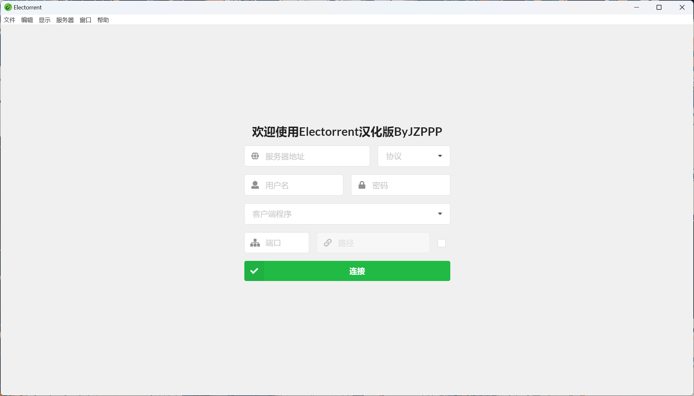
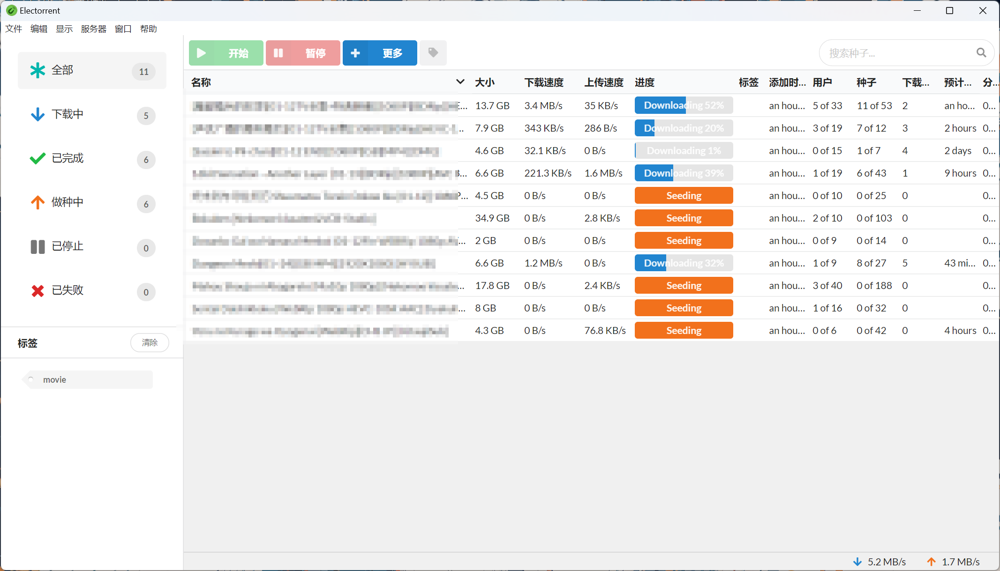
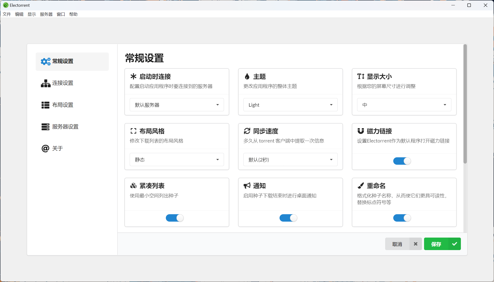

  

  
  
  

# 关于此仓库
Electorrent的个人汉化版，小孩子不懂事汉化着玩的
 <a href="https://github.com/JZPPP/Electorrent_CN/releases/latest">点击下载</a>  
【如果从原版覆盖安装后下载列表空白请在设置-布局设置中重新勾选需要显示的内容】

# Electorrent
Electorrent是您新的桌面远程种子下载应用程序。
原仓库[tympanix/Electorrent](https://github.com/tympanix/Electorrent)
## Support
Electorrent可以连接到以下 BitTorrent 客户端:
* [µTorrent](http://www.utorrent.com/)
* [qBittorrent](http://www.qbittorrent.org/) (v3.2.x and above)
* [Transmission](https://transmissionbt.com)
* [rTorrent](https://rakshasa.github.io/rtorrent/)
* [Synology Download Station](https://www.synology.com/en-global/knowledgebase/DSM/help/DownloadStation/DownloadStation_desc)
* [Deluge](https://deluge-torrent.org/)

## Downloads
* 仅测试WIN11 64位可用
* [Windows](https://github.com/JZPPP/Electorrent_CN/releases/latest)

## Screenshots

  

  

  

